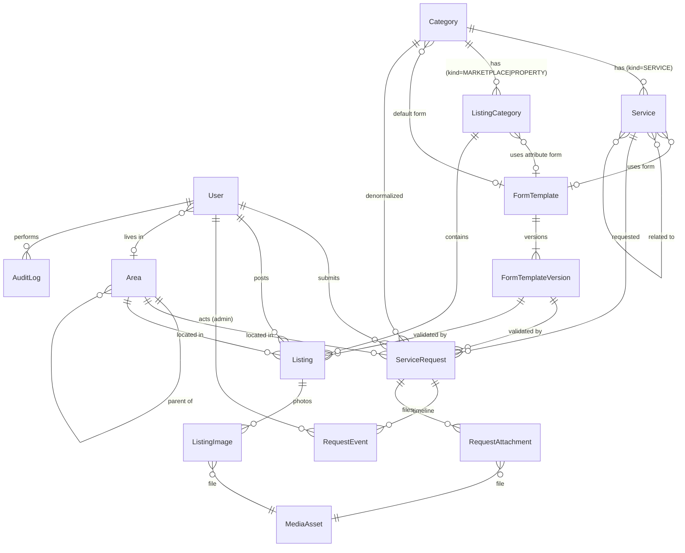

# 02 — Data Model: Entities & Relations

## 1. Entity overview

| Group | Entity | Purpose |
|---|---|---|
| Identity | `User`, `Session`, `Account`, `Verification`, `TwoFactor` | Better Auth tables (generated). `User.role` drives user vs admin |
| Geography | `Area` | Self-referencing tree: district → upazila → area. Used by requests, listings, users, (future) provider service areas |
| Catalog | `Category` | The 12 homepage parents. `kind` decides behaviour: SERVICE / MARKETPLACE / PROPERTY / CUSTOM_REQUEST |
| | `Service` | Bookable sub-service under a SERVICE category. Points to a form template |
| | `ListingCategory` | Sub-category under MARKETPLACE or PROPERTY category. Points to an attribute template |
| Forms | `FormTemplate`, `FormTemplateVersion` | Versioned JSON form definitions (request forms + listing attribute forms) |
| Requests | `ServiceRequest` | One pipeline for service, order-style, emergency and custom requests |
| | `RequestEvent` | Status changes, internal notes, user-visible updates (timeline) |
| | `RequestAttachment` | Photos/files attached to a request, keyed by form field |
| Listings | `Listing`, `ListingImage` | Buy & Sell + Property classifieds, moderated |
| Media | `MediaAsset` | Every Cloudinary upload, with TEMP → ATTACHED lifecycle for orphan cleanup |
| CMS | `Banner`, `HomeSection`, `Page`, `SiteSetting` | Homepage content, static pages, hotline numbers etc. |
| Trust & ops | `Report`, `ContactMessage`, `AuditLog`, `SearchLog`, `BlockedPhone` | Complaints, contact form, admin audit trail, search analytics |

## 2. Relations (ER diagram)



Key rules:
- `Service.formTemplateId ?? Category.defaultFormTemplateId ?? 'generic_service'` resolves the form.
- A request/listing always stores the **exact `formVersionId`** it was validated against, so old
  records still render correctly after an admin edits the form.
- `ServiceRequest.categoryId` is denormalized from service (or set directly for custom requests
  with an admin-assigned category) so admin filters don't need joins.
- Slugs: `Category.slug` and `Service.slug` must be unique **across both tables** (shared `/services/[slug]`
  namespace). Enforce in the admin action + a seed-time check.

## 3. Future provider phase (do NOT build now — just don't block it)
Phase 2 will add: `Provider` (1–1 with `User`), `ProviderService` (M–N Service), `ProviderArea`
(M–N Area), `Lead` (ServiceRequest ↔ Provider, with status + fee), `Booking`, `Review`.
The MVP already supplies everything matching needs: `ServiceRequest.serviceId`, `areaId`,
`preferredDate`, and structured `details`. Nothing in MVP should need rebuilding — do not add
placeholder provider columns now.

## 4. Prisma schema (draft)

> Claude Code: generate the Better Auth models with the Better Auth CLI for the installed version,
> then merge the custom fields below into `User`. Adjust generator/datasource blocks to the installed
> Prisma major version. Add the raw-SQL migration at the end for trigram search indexes.

```prisma
// ───────── Enums ─────────
enum CategoryKind   { SERVICE MARKETPLACE PROPERTY CUSTOM_REQUEST }
enum PublishStatus  { DRAFT ACTIVE HIDDEN }
enum AreaType       { DISTRICT UPAZILA AREA }
enum FormKind       { REQUEST LISTING }

enum RequestType     { SERVICE CUSTOM }
enum RequestStatus   { NEW REVIEWING PROCESSING COMPLETED REJECTED CANCELLED }
enum RequestPriority { NORMAL HIGH EMERGENCY }
enum RequestSource   { WEB PHONE ADMIN }
enum RequestEventType { CREATED STATUS_CHANGE NOTE ASSIGNMENT QUOTE }

enum ListingKind     { MARKETPLACE PROPERTY }
enum ListingStatus   { DRAFT PENDING ACTIVE REJECTED CLOSED EXPIRED REMOVED }
enum ItemCondition   { NEW LIKE_NEW USED FOR_PARTS }
enum PricePeriod     { ONE_TIME PER_MONTH }
enum PropertyPurpose { RENT SALE }
enum PropertyType    { FLAT HOUSE ROOM OFFICE SHOP LAND COMMERCIAL OTHER }
enum SizeUnit        { SQFT DECIMAL KATHA BIGHA }

enum MediaPurpose   { LISTING REQUEST CMS AVATAR }
enum MediaStatus    { TEMP ATTACHED }
enum ReportTarget   { LISTING REQUEST USER OTHER }
enum TicketStatus   { OPEN RESOLVED DISMISSED }

// ───────── Identity (merge into Better Auth generated User) ─────────
model User {
  id                  String   @id
  name                String
  email               String?  @unique
  emailVerified       Boolean  @default(false)
  image               String?
  phoneNumber         String?  @unique      // E.164
  phoneNumberVerified Boolean  @default(false)
  role                String   @default("user") // user | operator | admin | super_admin
  banned              Boolean  @default(false)
  banReason           String?
  banExpires          DateTime?
  twoFactorEnabled    Boolean  @default(false)
  areaId              String?
  area                Area?    @relation(fields: [areaId], references: [id])
  createdAt           DateTime @default(now())
  updatedAt           DateTime @updatedAt

  requests        ServiceRequest[] @relation("RequestOwner")
  assignedRequests ServiceRequest[] @relation("RequestAssignee")
  requestEvents   RequestEvent[]
  listings        Listing[]
  media           MediaAsset[]
  auditLogs       AuditLog[]
  // sessions, accounts, twoFactor … from Better Auth
}

// ───────── Geography ─────────
model Area {
  id        String   @id @default(cuid())
  slug      String   @unique
  nameBn    String
  nameEn    String
  type      AreaType
  parentId  String?
  parent    Area?    @relation("AreaTree", fields: [parentId], references: [id])
  children  Area[]   @relation("AreaTree")
  sortOrder Int      @default(0)
  isActive  Boolean  @default(true)

  users    User[]
  requests ServiceRequest[]
  listings Listing[]
}

// ───────── Catalog ─────────
model Category {
  id                    String        @id @default(cuid())
  slug                  String        @unique
  kind                  CategoryKind
  nameBn                String
  nameEn                String
  shortDescBn           String?
  iconKey               String        // lucide icon name or custom svg key
  imageId               String?
  sortOrder             Int           @default(0) // "rank"
  status                PublishStatus @default(ACTIVE)
  showOnHome            Boolean       @default(true)
  keywords              String[]
  seoTitle              String?
  seoDescription        String?
  introContent          String?       // markdown, Bangla, mentions Bogura
  faqs                  Json          @default("[]") // [{q, a}]
  defaultFormTemplateId String?
  defaultFormTemplate   FormTemplate? @relation("CategoryDefaultForm", fields: [defaultFormTemplateId], references: [id])
  createdAt             DateTime      @default(now())
  updatedAt             DateTime      @updatedAt

  services          Service[]
  listingCategories ListingCategory[]
  requests          ServiceRequest[]
}

model Service {
  id             String        @id @default(cuid())
  categoryId     String
  category       Category      @relation(fields: [categoryId], references: [id])
  slug           String        @unique
  nameBn         String
  nameEn         String
  shortDescBn    String?
  description    String?       // markdown
  iconKey        String?
  imageId        String?
  keywords       String[]      // synonyms: "এসি", "ac", "air condition"
  startingPrice  Int?
  priceNote      String?
  sortOrder      Int           @default(0)
  status         PublishStatus @default(ACTIVE)
  isFeatured     Boolean       @default(false)
  isEmergency    Boolean       @default(false)
  allowGuest     Boolean       @default(true)  // D-03 admin kill-switch
  formTemplateId String?
  formTemplate   FormTemplate? @relation(fields: [formTemplateId], references: [id])
  seoTitle       String?
  seoDescription String?
  faqs           Json          @default("[]")
  relatedTo      Service[]     @relation("RelatedServices")
  relatedFrom    Service[]     @relation("RelatedServices")
  createdAt      DateTime      @default(now())
  updatedAt      DateTime      @updatedAt

  requests ServiceRequest[]
  @@index([categoryId, status, sortOrder])
}

model ListingCategory {
  id              String           @id @default(cuid())
  categoryId      String
  category        Category         @relation(fields: [categoryId], references: [id])
  slug            String           @unique
  nameBn          String
  nameEn          String
  iconKey         String?
  sortOrder       Int              @default(0)
  status          PublishStatus    @default(ACTIVE)
  propertyPurpose PropertyPurpose? // property sub-categories only
  propertyTypes   PropertyType[]   // allowed types for this sub-category
  formTemplateId  String?
  formTemplate    FormTemplate?    @relation(fields: [formTemplateId], references: [id])
  seoTitle        String?
  seoDescription  String?
  introContent    String?
  faqs            Json             @default("[]")

  listings Listing[]
}

// ───────── Form engine ─────────
model FormTemplate {
  id               String   @id @default(cuid())
  key              String   @unique // e.g. "ac_service", "vehicle_rent"
  name             String
  kind             FormKind
  description      String?
  currentVersionId String?  @unique
  currentVersion   FormTemplateVersion? @relation("CurrentVersion", fields: [currentVersionId], references: [id])
  createdAt        DateTime @default(now())
  updatedAt        DateTime @updatedAt

  versions          FormTemplateVersion[] @relation("TemplateVersions")
  services          Service[]
  listingCategories ListingCategory[]
  categoryDefaults  Category[] @relation("CategoryDefaultForm")
}

model FormTemplateVersion {
  id          String   @id @default(cuid())
  templateId  String
  template    FormTemplate @relation("TemplateVersions", fields: [templateId], references: [id])
  version     Int
  schema      Json     // FormSchema — see docs/03
  changelog   String?
  createdById String?
  createdAt   DateTime @default(now())

  currentOf FormTemplate? @relation("CurrentVersion")
  requests  ServiceRequest[]
  listings  Listing[]
  @@unique([templateId, version])
}

// ───────── Requests ─────────
model ServiceRequest {
  id                String          @id @default(cuid())
  code              String          @unique // AB-260926-0012
  type              RequestType
  status            RequestStatus   @default(NEW)
  priority          RequestPriority @default(NORMAL)
  source            RequestSource   @default(WEB)

  userId            String?         // null for guest requests until linked by verified phone (D-03)
  isGuest           Boolean         @default(false) // submitted without login (kept after linking, for analytics)
  isSpam            Boolean         @default(false)
  user              User?           @relation("RequestOwner", fields: [userId], references: [id])
  serviceId         String?
  service           Service?        @relation(fields: [serviceId], references: [id])
  categoryId        String?
  category          Category?       @relation(fields: [categoryId], references: [id])
  formVersionId     String?
  formVersion       FormTemplateVersion? @relation(fields: [formVersionId], references: [id])

  // Common fields (columns — filterable)
  title             String?         // required for CUSTOM
  contactName       String
  contactPhone      String
  altPhone          String?
  areaId            String?
  area              Area?           @relation(fields: [areaId], references: [id])
  addressLine       String?
  preferredDate     DateTime?
  preferredTimeSlot String?         // MORNING | AFTERNOON | EVENING | ANYTIME | "HH:mm"
  notes             String?

  // Service-specific answers, validated against formVersion.schema
  details           Json            @default("{}")

  // Admin side
  assignedToId      String?
  assignedTo        User?           @relation("RequestAssignee", fields: [assignedToId], references: [id])
  quotedAmount      Int?
  adminTags         String[]        // for "repeated custom requests" analysis
  closedAt          DateTime?
  createdAt         DateTime        @default(now())
  updatedAt         DateTime        @updatedAt

  events      RequestEvent[]
  attachments RequestAttachment[]

  @@index([status, createdAt])
  @@index([userId, createdAt])
  @@index([serviceId])
  @@index([categoryId, status])
  @@index([contactPhone])
}

model RequestEvent {
  id            String           @id @default(cuid())
  requestId     String
  request       ServiceRequest   @relation(fields: [requestId], references: [id], onDelete: Cascade)
  type          RequestEventType
  fromStatus    RequestStatus?
  toStatus      RequestStatus?
  message       String?
  visibleToUser Boolean          @default(false)
  actorId       String?
  actor         User?            @relation(fields: [actorId], references: [id])
  createdAt     DateTime         @default(now())
  @@index([requestId, createdAt])
}

model RequestAttachment {
  id        String         @id @default(cuid())
  requestId String
  request   ServiceRequest @relation(fields: [requestId], references: [id], onDelete: Cascade)
  mediaId   String
  media     MediaAsset     @relation(fields: [mediaId], references: [id])
  fieldKey  String         // which form field it belongs to
}

// ───────── Listings ─────────
model Listing {
  id                String          @id @default(cuid())
  code              String          @unique
  slug              String
  kind              ListingKind
  listingCategoryId String
  listingCategory   ListingCategory @relation(fields: [listingCategoryId], references: [id])
  userId            String
  user              User            @relation(fields: [userId], references: [id])
  formVersionId     String?
  formVersion       FormTemplateVersion? @relation(fields: [formVersionId], references: [id])

  title             String
  description       String
  price             Int?
  pricePeriod       PricePeriod     @default(ONE_TIME)
  negotiable        Boolean         @default(false)
  condition         ItemCondition?  // marketplace only
  areaId            String
  area              Area            @relation(fields: [areaId], references: [id])
  addressLine       String?
  contactName       String
  contactPhone      String
  whatsappEnabled   Boolean         @default(true)

  // Promoted property columns (filterable). Null for marketplace.
  propertyPurpose   PropertyPurpose?
  propertyType      PropertyType?
  bedrooms          Int?
  bathrooms         Int?
  sizeValue         Decimal?
  sizeUnit          SizeUnit?
  availableFrom     DateTime?

  attributes        Json            @default("{}") // category-specific, per formVersion
  status            ListingStatus   @default(PENDING)
  rejectionReason   String?
  publishedAt       DateTime?
  expiresAt         DateTime?
  viewCount         Int             @default(0)
  createdAt         DateTime        @default(now())
  updatedAt         DateTime        @updatedAt

  images ListingImage[]

  @@index([kind, status, listingCategoryId, publishedAt])
  @@index([kind, status, propertyPurpose, propertyType])
  @@index([areaId])
  @@index([price])
  @@index([userId])
}

model ListingImage {
  id        String     @id @default(cuid())
  listingId String
  listing   Listing    @relation(fields: [listingId], references: [id], onDelete: Cascade)
  mediaId   String
  media     MediaAsset @relation(fields: [mediaId], references: [id])
  sortOrder Int        @default(0)
}

// ───────── Media ─────────
model MediaAsset {
  id           String       @id @default(cuid())
  publicId     String       @unique
  url          String
  width        Int?
  height       Int?
  bytes        Int?
  format       String?
  purpose      MediaPurpose
  status       MediaStatus  @default(TEMP)
  uploadedById String?
  uploadedBy   User?        @relation(fields: [uploadedById], references: [id])
  createdAt    DateTime     @default(now())

  listingImages      ListingImage[]
  requestAttachments RequestAttachment[]
  @@index([status, createdAt])
}

// ───────── CMS ─────────
model Banner {
  id        String    @id @default(cuid())
  placement String    // HOME_HERO | HOME_MID | CATEGORY_TOP
  titleBn   String?
  subtitleBn String?
  mediaId   String
  linkUrl   String?
  sortOrder Int       @default(0)
  isActive  Boolean   @default(true)
  startsAt  DateTime?
  endsAt    DateTime?
}

model HomeSection {
  id        String  @id @default(cuid())
  key       String  @unique  // quick_actions, popular_services, recent_listings, local_products, protutors, it_digital
  type      String           // SERVICES | CATEGORY_SPOTLIGHT | LISTINGS | QUICK_ACTIONS
  titleBn   String
  config    Json    @default("{}") // { serviceIds?, categoryId?, listingKind?, limit? }
  sortOrder Int     @default(0)
  isActive  Boolean @default(true)
}

model Page {
  slug           String   @id // about, contact, help, terms, privacy
  titleBn        String
  content        String   // markdown
  seoDescription String?
  updatedAt      DateTime @updatedAt
}

model SiteSetting {
  key       String   @id // hotline, whatsapp, ambulance_phone, social_links, admin_notify_emails
  value     Json
  updatedAt DateTime @updatedAt
}

// ───────── Trust & ops ─────────
model Report {
  id           String       @id @default(cuid())
  reporterId   String?
  targetType   ReportTarget
  targetId     String
  reason       String       // SCAM | WRONG_INFO | SOLD | OFFENSIVE | OTHER
  details      String?
  status       TicketStatus @default(OPEN)
  resolvedById String?
  createdAt    DateTime     @default(now())
  @@index([status, createdAt])
}

model ContactMessage {
  id        String       @id @default(cuid())
  name      String
  phone     String?
  email     String?
  subject   String?
  message   String
  status    TicketStatus @default(OPEN)
  createdAt DateTime     @default(now())
}

model AuditLog {
  id         String   @id @default(cuid())
  actorId    String?
  actor      User?    @relation(fields: [actorId], references: [id])
  action     String   // e.g. "request.status_change", "listing.approve", "service.update"
  entityType String
  entityId   String
  before     Json?
  after      Json?
  ipHash     String?
  createdAt  DateTime @default(now())
  @@index([entityType, entityId])
  @@index([actorId, createdAt])
}

model BlockedPhone {
  phone     String   @id // E.164
  reason    String?
  createdById String?
  createdAt DateTime @default(now())
}

model SearchLog {
  id          String   @id @default(cuid())
  query       String
  resultCount Int
  userId      String?
  createdAt   DateTime @default(now())
  @@index([createdAt])
}
```

### Raw SQL migration (search)
```sql
CREATE EXTENSION IF NOT EXISTS pg_trgm;
CREATE INDEX service_name_bn_trgm ON "Service" USING gin ("nameBn" gin_trgm_ops);
CREATE INDEX service_name_en_trgm ON "Service" USING gin ("nameEn" gin_trgm_ops);
CREATE INDEX category_name_bn_trgm ON "Category" USING gin ("nameBn" gin_trgm_ops);
CREATE INDEX listing_title_trgm ON "Listing" USING gin ("title" gin_trgm_ops);
-- keywords[]: search via array_to_string(keywords,' ') in the query, or a generated tsv column
```

## 5. State machines

**ServiceRequest.status**
```
NEW → REVIEWING → PROCESSING → COMPLETED
  ↘        ↘            ↘
   REJECTED  REJECTED    REJECTED
NEW/REVIEWING → CANCELLED (by user, with reason)
```
Every transition writes a `RequestEvent` (and `AuditLog` if by admin). Allowed transitions live in one
`canTransition(from, to, actorRole)` function with unit tests.

**Listing.status**
```
DRAFT → PENDING → ACTIVE → CLOSED | EXPIRED | REMOVED
             ↘ REJECTED → (user edits) → PENDING
EXPIRED → (user renews) → PENDING or ACTIVE (admin setting)
```
Editing an ACTIVE listing's title/price/photos sends it back to PENDING.
